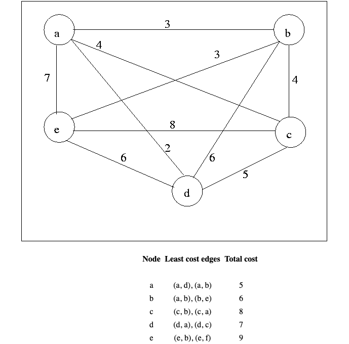
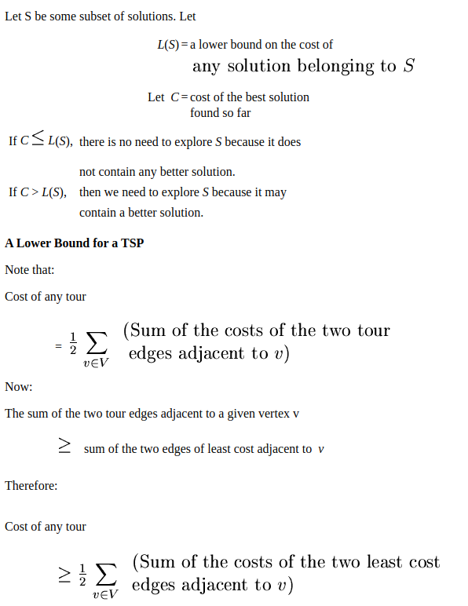
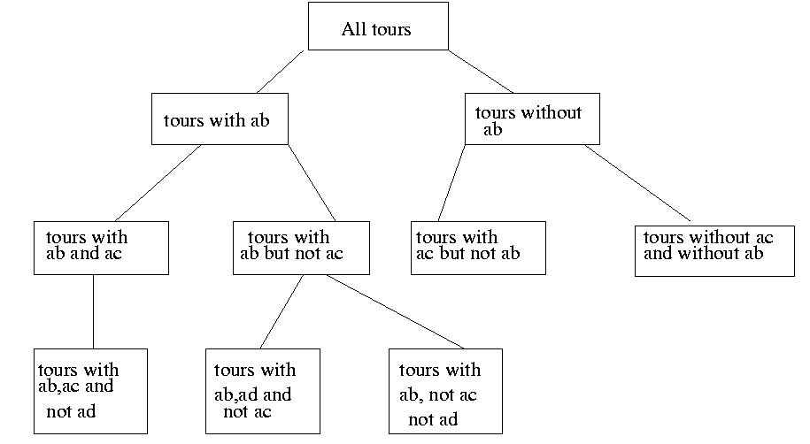
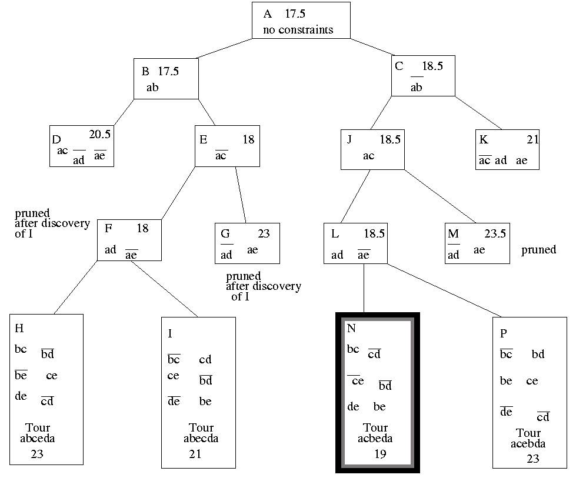
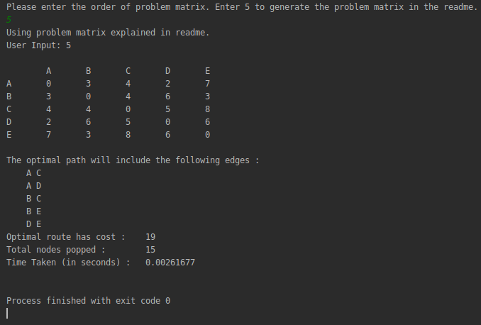
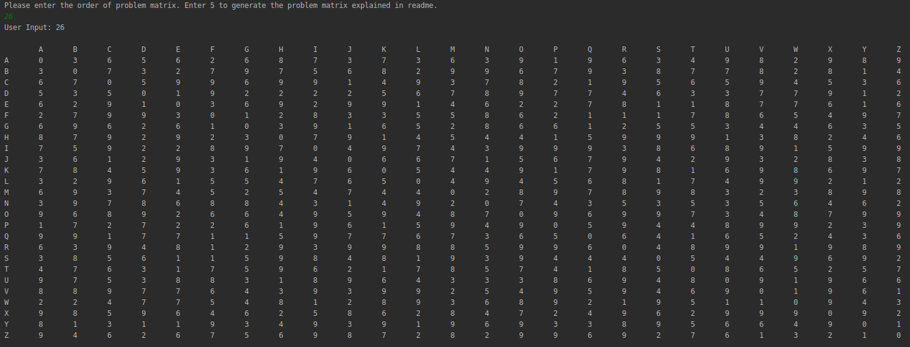
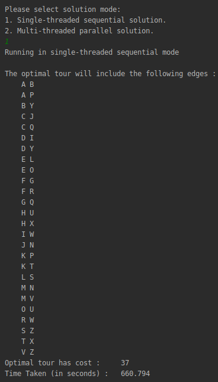

# Travelling Salesman Problem

The **traveling salesman problem** is a problem in graph theory requiring the most efficient (i.e., least total distance) [Hamiltonian cycle](http://mathworld.wolfram.com/HamiltonianCycle.html) a salesman can take through each of **n cities**. No general method of solution is known, and the problem is [*NP-hard*](http://mathworld.wolfram.com/NP-HardProblem.html).

## Optimal Solution for Travelling Salesman Problem using Branch and Bound

Consider the following graph:

Consider **node d**. If **node d** has to be explored, it can be entered via the least cost **edge(d, a)** and exit via the second least cost **edge(d, c)**. So, in best-case scenario, the least cost associated with exploring **node d**, through arriving and leaving via least expensive edges is *7*.

Using this information, a cost function is defined. The cost function calculates the least cost associated with exploring a solution with some given constraints. For an optimal solution, the cost function needs to be minimized.

## Cost function

The lower bound on the cost of visiting any node is the sum of the least cost edges incident on it. Therefore, doing the same for all the nodes will give a lowerbound on cost of visiting each node in a tour. **The lowerbound on complete tour cost of such a path (or route) is therefore half of sum of all least cost edges (every edge in a tour is considered twice while calculating lowerbound).**

Therefore for the **problem graph** *without any constraints*, the lowerbound on any optimal tour is

	1/2 * (5 + 6 + 8 + 7 + 9) = 17.5

Mathematically,

From the solution set S of possible tours, another function is defined which goes over the nodes in **ascending order** and marks them for *inclusion or exclusion* in a given tour.  

For example, **city 0 (or A)** is considered **start**. **city 1 (or B)** is considered after **city 0 (or A)**. The function marks **edge(city 0, city 1)** or **edge(A, B)** for *exclusion / inclusion* and then calculates the lowerbound of **tours with ab** and a **tours without ab**.

Every time a new branch is created in this procedure, the following information is updated. 

1. If **excluding edge(x, y) would make it impossible for node x or node y to have as many as two adjacent edges** in the tour, then **edge(x, y) must be included.**
2. If **including edge(x, y) would cause node x or node y to have more than two edges adjacent in the tour, or would complete a non-tour cycle** with edges already included, **then edge(x, y) must be excluded.**

For e.g, **tours with ab and ac** necessitates the following updates:

* **node a** can only be reached by **edge(a, b)** and **edge(a, c)**.
* **node c** has one edge set to **edge(a, c)**.
* **node b** has one edge set to **edge(a, b)**.
* **node d** can not be reached by **edge(a, d)**, because **node a** already has two adjacent edges.
* **node e** can not be reached by **edge(a, e)**, because **node a** already has two adjacent edges.

## Problem Matrix and Solution Tree

The problem assumes that all nodes are connected to each other via bidirectional edges,  
i.e. **edge(a, d)** *is same as* **edge(d, a)**.  
**Tour N** gives the optimal (or lowest) **route cost (19)**.  

## Sequential Solution

**Randomly generated problem matrix having 26 nodes:**

## References

* [**Game Theory Lab, Department of Computer Science and Automation, Indian Institute of Science Bangalore**](http://lcm.csa.iisc.ernet.in/dsa/node187.html)

* [**Wolfram MathWorld**](http://mathworld.wolfram.com/TravelingSalesmanProblem.html)