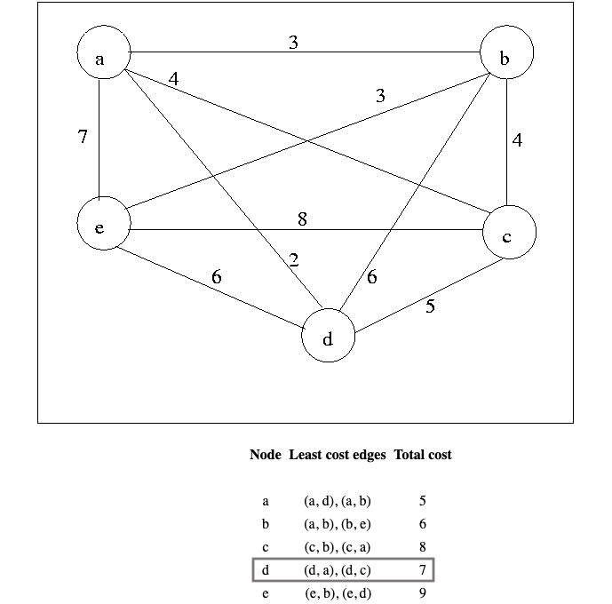

# Travelling Salesman Problem 

The **traveling salesman problem** is a problem in graph theory requiring the most efficient (i.e., least total distance) [Hamiltonian cycle](http://mathworld.wolfram.com/HamiltonianCycle.html) a salesman can take through each of **n cities**. No general method of solution is known, and the problem is [*NP-hard.*](http://mathworld.wolfram.com/NP-HardProblem.html)

Consider the following graph:

Consider **node d**. If **node d** has to be explored, it can be entered via the least cost **edge(d, a)** and exit via the second least cost **edge(d, c)**. So, in best-case scenario, the least cost associated with exploring **node d**, through arriving and leaving via least expensive edges is *7*.

Using this information, a cost function is defined. The cost function calculates the least cost associated with exploring a solution with some given constraints. For an optimal solution, the cost function needs to be minimized.

## Cost function

The lower bound on the cost of visiting any node is the sum of the least cost edges incident on it. Therefore, doing the same for all the nodes will give a lower bound on cost of visiting each node in a tour. **The lower bound on complete tour cost of such a path (or route) is therefore half of sum of all least cost edges (every edge in a tour is considered twice while calculating lower bound).**

Therefore for the **problem graph** *without any constraints*, the lower bound on any optimal tour is

	1/2 * (5 + 6 + 8 + 7 + 9) = 17.5

Mathematically,

From the solution set S of possible tours, another function is defined which goes over the nodes in **ascending order** and marks them for *inclusion or exclusion* in a given tour.  

For example, **city 0 (or A)** is considered **start**. **city 1 (or B)** is considered after **city 0 (or A)**. The function marks **edge(city 0, city 1)** or **edge(A, B)** for *exclusion / inclusion* and then calculates the lower bound of **tours with ab** and **tours without ab**.

Every time a new branch is created in this procedure, the following information is updated. 

1. If **excluding edge(x, y) would make it impossible for node x or node y to have as many as two adjacent edges** in the tour, then **edge(x, y) must be included.**
2. If **including edge(x, y) would cause node x or node y to have more than two edges adjacent in the tour, or would complete a non-tour cycle** with edges already included, **then edge(x, y) must be excluded.**

For e.g, **tours with ab and ac** necessitates the following updates:

* **node a** can only be reached by **edge(a, b)** and **edge(a, c)**.
* **node c** has one edge set to **edge(a, c)**.
* **node b** has one edge set to **edge(a, b)**.
* **node d** can not be reached by **edge(a, d)**, because **node a** already has two adjacent edges.
* **node e** can not be reached by **edge(a, e)**, because **node a** already has two adjacent edges.

When a branch is created, after making what inferences can be made, the lower bounds for both children are computed. **If the lower bound for a child is as high or higher than the lowest cost found so far, that child can be *pruned* and it need not be considered or its descendants constructed.**

* Interestingly, there are situations where the lower bound for a **node n** is lower than the best solution so far, yet both children of n can be pruned because their lower bounds exceed the cost of the best solution so far.

* If neither child can be pruned, then, as a heuristic, the child with the smaller lower bound is considered first. After considering one child, it must be considered again whether its sibling can be pruned, since a new best solution may have been found.

## Problem Matrix and Solution Tree

The problem assumes that all nodes are connected to each other via undirected or bidirectional edges. The problem graph is a complete graph. This means that all nodes are connected to one another via undirected edges.  

i.e. **edge(a, d)** *is same as* **edge(d, a)**.  

The problem graph is used to create a solution tree. At every level, the data about which nodes are to be included or excluded is updated. 
 

Distance from **node A** to **node B** *is equal to* distance from **node B** to **node A**. The *problem graph* is used to create the *problem matrix*. The rows and columns are filled with distances from cities to one another, leading to the creation of a symmetric matrix. 

The *problem matrix* for the *problem graph* can be seen below. *Notice that distance from a city to itself is 0*.

An optimal tour is: **A -> C -> B -> E -> D -> A**

# Sequential Solution vs Multi-threaded Solution

Consider the following problem matrix representing 29 cities. For the sake of simplicity, *distances between cities to one another is always randomly set between 1 - 9*, and the *distance of a city from itself is always set to 0*.

The problem matrix can be either solved sequentially or thread-based parallelism can be introduced. Parallelism can drastically improve performance at the cost of increased system complexity.

## Sequential Solution
The main thread handles all the operations. Performance is not optimal and the system resources are not being exploited fully. It can clearly be seen that only one CPU core is being stressed at any time.

**Problem with 29 cities, solved sequentially, takes about 40 minutes.**

## Multi-threaded Solution
*Mutex* is introduced to deal with threads trying to access the same data concurrently. *Race conditions* are avoided this way. All threads share the workload leading to massive improvements in performance.

**Problem with 29 cities, solved with thread based parallelism, takes about 11 minutes.**

## Overview

Below are some of the observed values on a system with 6 actual cores and 6 virtual cores. There is not much difference between the two methods for small number of cities, but the difference grows exponentially as the number of cities increase.

|No. of cities 		| Optimal Tour Cost |     Time taken : Sequential Solution | Time taken : Parallel Solution|
| ----------------|:-------------:| -----:|-------:|
| 5	|	19		|	**0.00120875** seconds	| **0.00357606** seconds
| 10		|22	|		**0.0180687** seconds	|  **0.0130591** seconds
| 15   	| 31	|		**0.479548** seconds | **0.152671** seconds
| 20 	| 33 	|  **16.9916** seconds | **4.43818** seconds
| 22    	| 36 	|	**8.0414** seconds | **1.87537** seconds
| 24		|	36	|	**51.9371** seconds | **13.0014** seconds
| 26 	|	37	| **654.127** seconds or ***10.90*** *minutes*| **193.009** seconds or ***3.21*** *minutes*
| 28	 	|	37  |	**527.881** seconds ***8.79*** *minutes*| **143.635** seconds or ***3.29*** *minutes*
| 29		|	38  |    **2411.89** seconds or ***40.19*** *minutes*| **683.101** seconds ***11.38*** *minutes*
 

## References

Some resources on understanding and solving the Travelling Salesman Problem.

* [**Game Theory Lab, Department of Computer Science and Automation, Indian Institute of Science Bangalore**](http://lcm.csa.iisc.ernet.in/dsa/node187.html)

* [**Wolfram MathWorld**](http://mathworld.wolfram.com/TravelingSalesmanProblem.html)