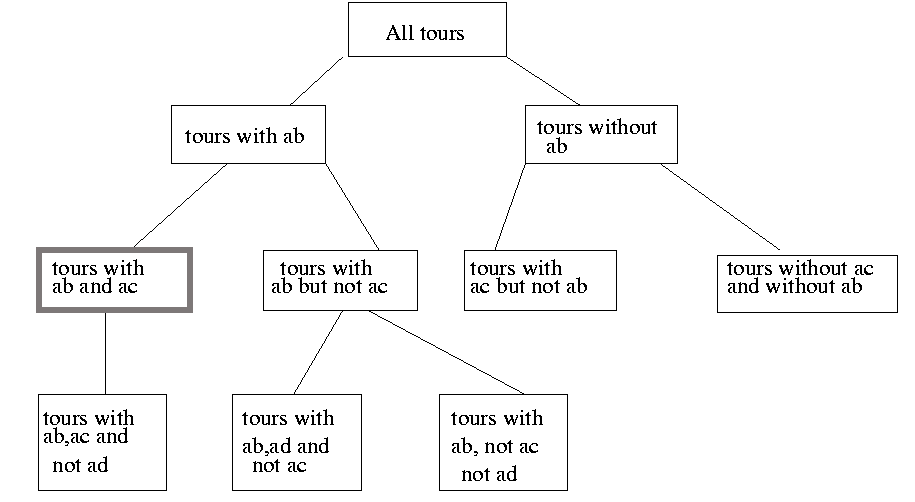

# Travelling Salesman Problem

The traveling salesman problem is a problem in graph theory requiring the most efficient (i.e., least total distance) [Hamiltonian cycle](http://mathworld.wolfram.com/HamiltonianCycle.html) a salesman can take through each of n cities. No general method of solution is known, and the problem is [NP-hard](http://mathworld.wolfram.com/NP-HardProblem.html).

## Optimal Solution for Travelling Salesman Problem using Branch and Bound.

Consider the following graph:

It is required to minimize an objective cost function. The cost function can be defined as the minimum cost to explore any vertex.  

For e.g, if vertex **d** has to be explored, it can be reached via the least cost *node* **(d, a)** and left via the second least cost *node* **(d, c)**. So, in the best scenario, the least cost associated with exploring **d** is *7*.

Using this information, a cost function is defined. The cost function calculates the least cost associated with exploring a node given some constraints:

Everytime a new branch is created, the following information is updated. 

1. If excluding node (x, y) would make it impossible for x or y to have as many as two adjacent edges in the tour, then node (x, y) must be included.
2. If including node (x, y) would cause x or y to have more than two edges adjacent in the tour, or would complete a non-tour cycle with edges already included, then node (x, y) must be excluded.

For e.g, **tours with ab and ac** necessitates the following updates:

* vertex a can only be reached nodes (a, b) and (a, c)
* vertex c has one node set to (a, c)
* vertex b has one node set to (a, b)
* vertex d can not be reached by (a, d), because a has two adjacent edges
* vertex e can not be reached by (a, e), because a has two adjacent edges

## Formulation of Problem Matrix
The problem assumes that all places are connected to each other via bidirectional nodes,  
i.e *node* **(a, d)** is same as *node* **(d, a)**.

## Sequential Solution
Time taken to solve a matrix of 25 cities without parallelization.

### Randomly generated Problem Matrix

### Result

