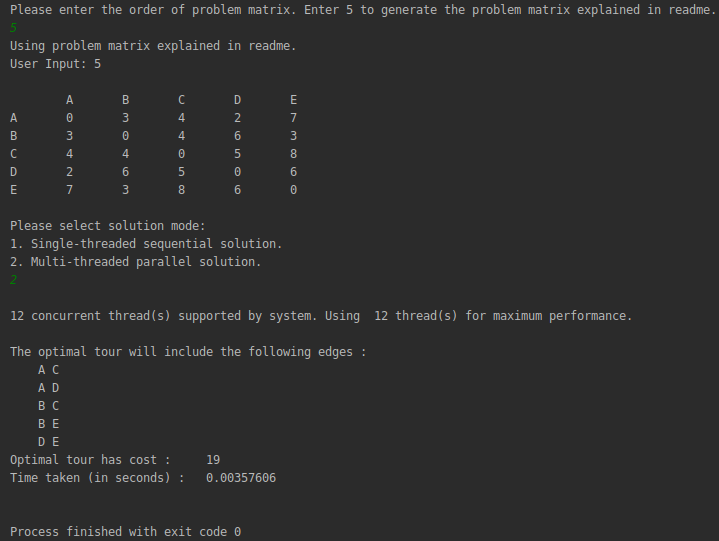

# Travelling Salesman Problem

The **traveling salesman problem** is a problem in graph theory requiring the most efficient (i.e., least total distance) [Hamiltonian cycle](http://mathworld.wolfram.com/HamiltonianCycle.html) a salesman can take through each of **n cities**. No general method of solution is known, and the problem is [*NP-hard*](http://mathworld.wolfram.com/NP-HardProblem.html).

## Optimal Solution for Travelling Salesman Problem using Branch and Bound.

Consider the following graph:

Consider edge **d**. If edge **d** has to be explored, it can be entered via the least cost *node* **(d, a)** and exit via the second least cost *node* **(d, c)**. So, in best-case scenario, the least cost associated with exploring **d**, through arriving and leaving via least expensive routes is *7*.

Using this information, a cost function is defined. The cost function is the minimum cost to explore any edge.  The cost function calculates the least cost associated with exploring a node given some constraints. For an optimal solution, the cost function needs to be minimized.

## Cost function

The lower bound on the cost of visiting any edge is the sum of the least cost edges incident on it. Therefore, doing the same for all the edges will give a lowerbound on cost of visiting each node. The complete trip cost of such a path (or route) is therefore half of sum of all least cost edges (every edge is considered twice while calculating lowerbound).

Let this be **routeCost**. 
Therefore for the problem graph without any constraints, **routeCost** is 

	1/2 * (5 + 6 + 8 + 7 + 9) = 17.5

From the solution set S, another function is defined which goes over the edges in ascending order and marks them for inclusion or exclusion.  

That is, city 0 is start and city 1 is considered after city 0. The function marks node(cito 0, city 1) for exclusion / inclusion and then calculates the lowerbound of a solution with the associated constraints.

Every time a new branch is created from this procedure, the following information is updated. 

1. If excluding node (x, y) would make it impossible for x or y to have as many as two adjacent edges in the tour, then node (x, y) must be included.
2. If including node (x, y) would cause x or y to have more than two edges adjacent in the tour, or would complete a non-tour cycle with edges already included, then node (x, y) must be excluded.

For e.g, **tours with ab and ac** necessitates the following updates:

* edge a can only be reached by nodes (a, b) and (a, c).
* edge c has one node set to (a, c)
* edge b has one node set to (a, b)
* edge d can not be reached by (a, d), because a already has two adjacent edges
* edge e can not be reached by (a, e), because a already has two adjacent edges

## Formulation of Problem Matrix

The problem assumes that all edges are connected to each other via bidirectional nodes,  
i.e *node* **(a, d)** is same as *node* **(d, a)**.

## Sequential Solution
Time taken to solve a problem matrix(or graph) of 25 edges(or cities) without parallelization.

### Randomly generated Problem Matrix

## References

* [**Game Theory Lab, Department of Computer Science and Automation, Indian Institute of Science Bangalore**](http://lcm.csa.iisc.ernet.in/dsa/node187.html)

* [**Worlfram Mathworld**](http://mathworld.wolfram.com/TravelingSalesmanProblem.html)
